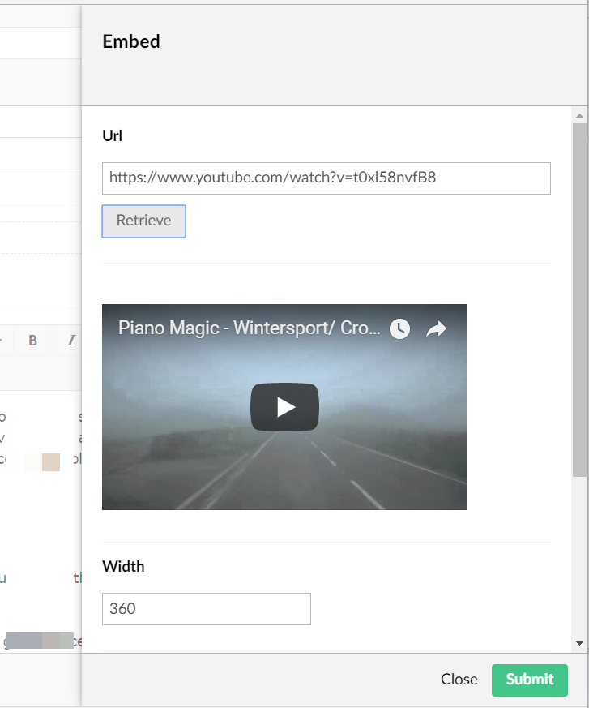
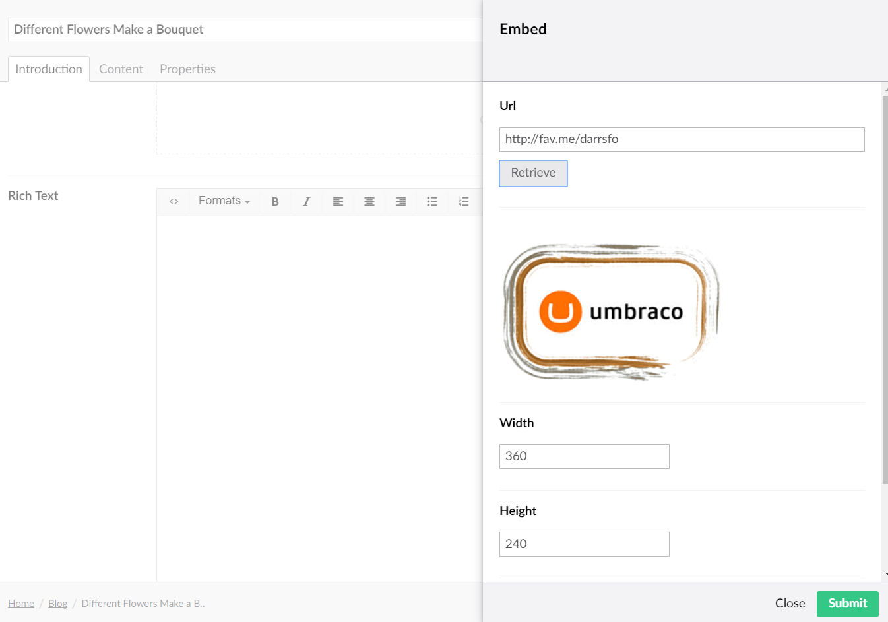

# Embedded Media Providers

The Rich Text Editor in Umbraco has an 'Embed' button, that when pressed, slides open a panel to enable editors to paste the Url of a third party media resource to embed in content.

For example, a You Tube Video...

It is the job of an 'Embedded Media Provider', to accept the pasted Url, and to write out the appropriate embed markup for the provider associated with the Url.

## EmbeddedMedia Configuration

The list of available Embedded Media Providers in an Umbraco install are configured in the file **/config/embeddedmedia.config**

Umbraco ships with configuration to embed media from the following third party providers:

* Flickr
* SlideShare
* Kickstarter
* GettyImages
* PollEverywhere
* PollDaddy
* IFTTT
* Instagram
* Rdio
* SoundCloud
* YouTube
* StreamUmbraco
* DailyMotion
* Hulu
* Vimeo
* TedTalks
* Screenr
* Twitgoo
* Twitter

## Configuring a new provider

If the provider you want to add supports the *OEmbed* format for embedding a representation of a Url in a website, then you can usually make use of Umbraco's provided generic OEmbed providers:

OEmbedJson, OEmbedPhoto, OEmbedRich, OEmbedVideo, OEmbedResponse

...and then map the 'url' of the provider (using a regular expression) to the relevant generic provider in the /config/embeddedmedia.config file.

### Configuration Example

Let's allow our editors to embed artwork from the popular DeviantArt website - the world's largest online social community for artists and art enthusiasts. We can see they have information on using oembed: https://www.deviantart.com/developers/oembed
and the format of their OEmbed implementation returns a Json format, from a url http://backend.deviantart.com/oembed?url=[urltoembed] , so we'll need to use the OEmbedJson provider, we can see 'links' to media shared on deviantart are in the format: http://fav.me/[uniquemediaidentifier] so we'll need a regex to match any urls pasted into the embed panel that start with *fav.me*

The configuration would look like this:

      <provider name="DeviantArt" type="Umbraco.Web.Media.EmbedProviders.OEmbedJson, umbraco">
        <urlShemeRegex><![CDATA[fav\.me/]]></urlShemeRegex>
        <apiEndpoint><![CDATA[http://backend.deviantart.com/oembed?url=]]></apiEndpoint>
        <requestParams type="Umbraco.Web.Media.EmbedProviders.Settings.Dictionary, umbraco"></requestParams>
      </provider>

Recycle the application pool, and the new provider should be available for editors to use:

## Custom Embedded Media Providers

But if your third party media provider does not support oEmbed or there is some quirk with the content being embedded that you cannot use the existing Umbraco generic OEmbed providers, then you can create your own custom implementation of an Embedded Media Provider!

Umbraco provides an AbstractProvider class (or AbstractOEmbedProvider) to get your custom implementation started, and you need to implement pnly two methods:

* SupportsDimension - whether the third party provider supports the concept of dimensions (eg images and videos).
* GetMarkUp - the method responsible for writing out the markup to embed based on the Url the editors have pasted into the embed panel.

### Custom Embedded Media Provider Example

Azure Media Services - https://azure.microsoft.com/en-gb/services/media-services/ - provide 'broadcast-quality' video streaming services, and you can embed the Azure Media Player into your site to play a video using an IFrame: 
http://ampdemo.azureedge.net/azuremediaplayer.html

We can create a custom Embedded Media Provider to do the job of taking the Url of the Media asset and writing out the markup required to embed the IFrame in your content.

    namespace Our.Umbraco.Media.EmbedProviders
    {
        public class AzureVideoEmbed : AbstractProvider
        {
            public override bool SupportsDimensions
            {
                get { return true; }
            }

            public override string GetMarkup(string url, int maxWidth, int maxHeight)
            {
                //format of markup
                string videoFormat = "
<iframe src=\"//aka.ms/ampembed?url={0}\" name=\"azuremediaplayer\" scrolling=\"no\" frameborder=\"no\" align=\"center\" autoplay=\"false\" width=\"{1}\" height=\"{2}\" allowfullscreen></iframe>
";
                //pass in encoded Url, with and height, and turn off autoplay...                
                var videoPlayerMarkup = string.Format(videoFormat, HttpUtility.UrlEncode(url) + "&amp;autoplay=false", maxWidth, maxHeight);
                return videoPlayerMarkup;
            }
        }
    }

Now we need to add the configuration for the custom provider to our /config/embeddedmedia.config file:

     <!-- Azure Video - format of urls: streaming.mediaservices.windows.net-->
      <provider name="AzureVideo" type="Our.Umbraco.Media.EmbedProviders.AzureVideoEmbed, Our.Umbraco.Media">
        <urlShemeRegex><![CDATA[windows\.net/]]></urlShemeRegex>
      </provider>

