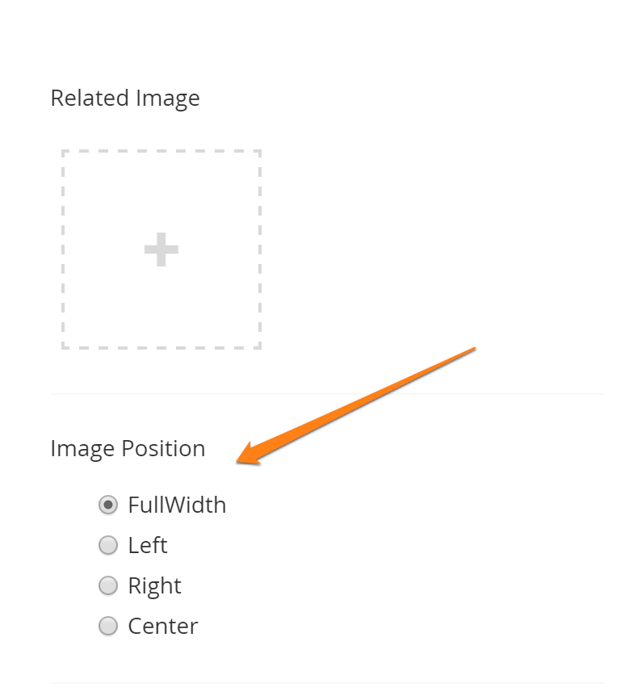

# Macro Parameter Editors

Every macro can contain parameters. There are some useful default types.  For example: 

* True/False
* TextBox
* TextArea
* Numeric
* Single/Multiple Media Picker
* Single/Multiple Content Picker

... and some 'others'.  Consult the [Backoffice documentation](../../Using-Umbraco/Backoffice-Overview.md) for general information on Macros.

You can create your own custom macro parameter types.

## Umbraco 7 - Creating your own macro parameter type ##

### isParameterEditor ###
All you need to do to create a macro parameter type in Umbraco 7, is to create a custom 'Property Editor' (or copy someone else's), see [Property Editors documentation](../../Extending/Property-Editors.md)
and in the [Package Manifest file](../../Extending/Property-Editors/package-manifest.md) for the editor, set the isParameterEditor property to be true.

    propertyEditors: [
        {
            alias: "My.ParameterEditorAlias",
            name: "Parameter Editor Name",
            isParameterEditor: true,
            editor: {
                view: "~/App_Plugins/My.ParameterEditor/ParameterEditorView.html"
            }
        }
    ]
### PreValues/Configuration/DefaultValues ###
However 'Parameter Editors' unlike 'Property Editors' cannot contain 'prevalues', since there is no UI to present configuration option in the Macro Parameter tab when a particular type is chosen. You can use the defaultConfig option to pass a one off default set of configuration for the parameter editor to use:

    defaultConfig: {
        wolf: "nope",
        editor: "hello",
        random: 1234
    }

This is only a problem if you have a macro parameter type, that needs to be used on lots of different macros, but with slightly different configuration in each instance.

### Example ###

We'll create a simple 'Image Position' Macro Parameter type providing a Radio Button list of options for positioning an image that has been inserted via the Macro.

#### Package Manifest ####

    {
     "propertyEditors": [ 
     {
        "alias": "tooorangey.ImagePosition",
        "name": "Image Position",
        "isParameterEditor": true,
        "editor": {
            "view": "~/App_Plugins/tooorangey.ImagePosition/ImagePosition.html",
            "valueType": "STRING"
        }
    }],
     "javascript": [
        "~/App_Plugins/tooorangey.ImagePosition/ImagePosition.controller.js"
     ]
    }

#### View ####

    

        

            <label>
                <input type="radio" name="position" ng-model="model.value" value="{{position.Name}}">{{position.Name}}
            </label>
        

    

#### Controller ####

    angular.module("umbraco").controller("tooorangey.ImagePositionController", function ($scope) {

         if ($scope.model.value == null) {
            $scope.model.value = 'FullWidth';
         }
         //could read positions from defaultConfig
        $scope.positions = [
            {
                Name: 'FullWidth'
            },
            {
                Name: 'Left'
            },
            {
                Name: 'Right'
            },
            {
                Name: 'Center'
            }
        ];
    });

#### Display ####

The final custom parameter should look like this:

## Umbraco 6 - Creating your own macro parameter type ##

If you want to create a new macro parameter editor you will need some c# programming and database knowledge.

First create a class deriving from a webcontrol and implement the IMacroGuiRendering interface. Afterwards, open your database editor.  Find the **cmsMacroPropertyType** table and add the a new property editor.

### IMacroGuiRendering Interface ###
You can find this interface in the umbraco.interfaces namespace contained in the interfaces dll.  You will need to reference this DLL if you are developing your control in a separate project.
This interface implements 2 properties:  Value and ShowCaption.
The value stores a string  and the ShowCaption property a bool.

### Database update ###
<table>
<tr><th>
id</th><th>macroPropertyTypeAlias</th><th>macroPropertyTypeRenderAssembly</th><th>macroPropertyTypeRenderType</th><th>macroPropertyTypeBaseType</th></tr>
<tr><td>
28</td><td>myNewPickerType</td><td>NameOfAssembly</td><td>FullName.OfType.IncludingNamespace</td><td>String</td></tr></table>

### Example ###
A very basic example deriving from a DropDownList ASP.NET server control

    public class MyCustomPicker : DropDownList,  IMacroGuiRendering 
    {
		protected override void OnLoad(EventArgs e)
        {
            base.OnLoad(e);
            if(this.Items.Count == 0)
            {
                // set properties
                this.SelectionMode = ListSelectionMode.Multiple;           

                // load data
                ...
            }
        }

        public bool ShowCaption
        {
            get { return true; }
        }

        public string Value
        {
            get { return this.SelectedValue; }
            set { this.SelectedValue = value; }
        }
    }

### Further information ###
* A nice blog post by Richard Soeteman: [Create A Custom Macro ParameterType](http://www.richardsoeteman.net/2010/01/04/CreateACustomMacroParameterType.aspx)
