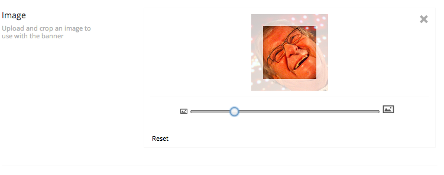

# Image Cropper

`Returns: JSON`

Returns a path to an image, along with information about focal point and available crops

## Settings

### Prevalues
You can add, edit & delete crop presets the cropper UI can use.

## Data Type Definition Example

## Content Example 

Provides a UI to upload an image, set a focal point on the image, and optionally crop and scale the image to predefined crops.
So by default, images in the cropper will be shown based on a set focal point, and only use specific crops if they are available.

The cropper comes in 3 modes:

- Uploading an image
- Setting a focal point
- Cropping the image to predefined crops

### Uploading images
The editor exposes a simple drop area for files. Click it to upload an image.

### Set focal point
By default, the cropper allows the editor to set a focal point on the uploaded image.
Below the image, all the preset crops are shown to give the editor a preview of what
the image will look like to the end user. 

### Crop and resize
If needed, the editor can crop the image to specific crop presets, to ensure the right part and size of the image
is shown for a specific crop.

## Sample code

Image Cropper comes with a simple to use API to generate crop urls, or you can access its raw data directly as a
dynamic object. 

In Umbraco v7.3.5 a UrlHelper Extension method was introduced to replace the IPublishedContent extension methods.

### MVC View Example to output a "banner" crop from a cropper property with the alias "image"

#### Typed (Umbraco v7.3.5+):

    

#### Typed (pre Umbraco v7.3.5):

    

#### Dynamic (Obsolete):
    
    // show the crop preset "banner"
    

    // or from specific node:
    

### MVC View Example to output create custom crops - in this case forcing a 300 x 400 px image

#### Typed (Umbraco v7.3.5+):
    
	@if (Model.Content.HasValue("image"))
    {
        
    }

#### Typed (pre Umbraco v7.3.5):
    
    @if (Model.Content.HasValue("image"))
    {
        
    }

### Media example to output a "banner" crop from a cropper property with alias "umbracoFile"

The cropped URL can also be found for media in a similar way:

#### Typed (Umbraco v7.3.5+):
    
    @{
        var mediaItem = Umbraco.TypedMedia(1234);
        if (mediaItem != null)
        {
            
        }
    }

#### Typed (pre Umbraco v7.3.5):

    @Umbraco.TypedMedia(1234).GetCropUrl("banner")

#### Dynamic (Obsolete):

    @Umbraco.Media(1234).GetCropUrl("banner")

### CSS background example to output a "banner" crop from a cropper property with alias "umbracoFile"

From Umbraco v7.3.5 there is an optional parameter "htmlEncode" which you and specify as false so that the Url is not Html encoded

#### Typed (Umbraco v7.3.5+):

    @{
        var mediaItem = Umbraco.TypedMedia(1234);
        if (mediaItem != null)
        {
            
        }
    }

### Data returned

The cropper returns a dynamic object, based on a json structure like this: 

                            
    {
      "focalPoint": {
        "left": 0.23049645390070922,
        "top": 0.27215189873417722
      },
      "src": "/media/SampleImages/1063/pic01.jpg",
      "crops": [
        {
          "alias": "banner",
          "width": 800,
          "height": 90
        },
        {
          "alias": "highrise",
          "width": 80,
          "height": 400
        },
        {
          "alias": "thumb",
          "width": 90,
          "height": 90
        }
      ]
    }

So you can access each property directly using dynamics:

    

Or iterate through them:
                       
    @foreach(var crop in CurrentPage.image.crops){
            
    }     

## Powered by ImageProcessor
[ImageProcessor](http://imageprocessor.org/) is an amazing project for modifying and processing images in a simple an efficient manner.

We bundle this library in Umbraco 7.1+ and you can therefore take full advantage of all its features out-of-the-box, like sharping, blurring, cropping, rotating and so.

### MVC View Example on how to blur a crop

#### Typed (Umbraco v7.3.5+):

    

#### Dynamic (Obsolete):

    

Using ImageProcessors built-in [gaussian blur](http://imageprocessor.org/imageprocessor-web/imageprocessingmodule/gaussianblur/)    

## Upload property replacement

You can replace an upload property with a cropper, existing images will keep returning their current path and work unmodified with the cropper 
applied. The old image will even be available in the cropper, so you can modify it if you ever need to. 

However, be aware that a cropper returns a dynamic object when saved, so if you perform any sort of string modifications on your upload property value, 
you will most likely see some errors in your templates / macros.

