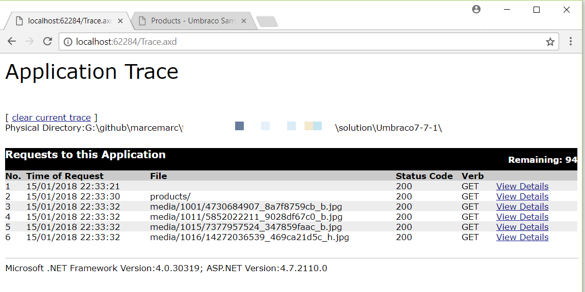
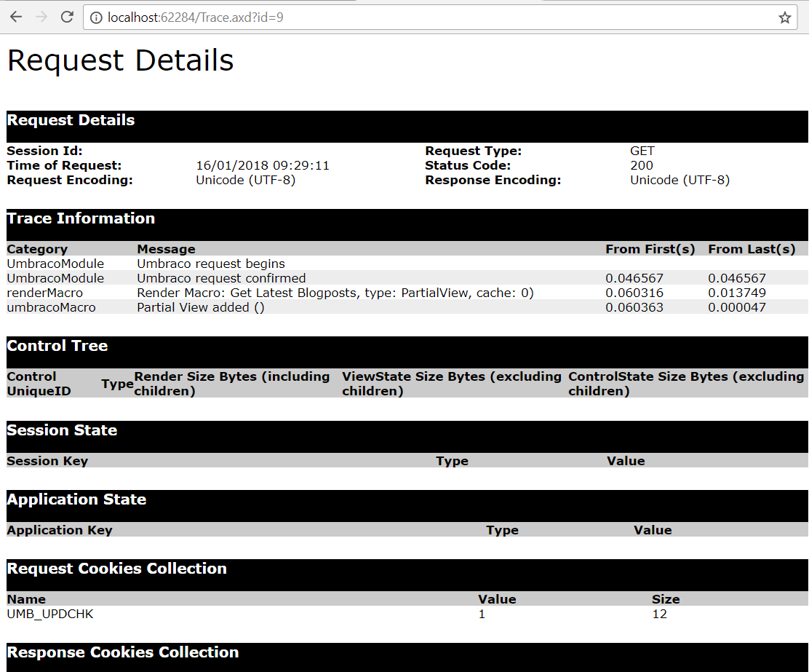
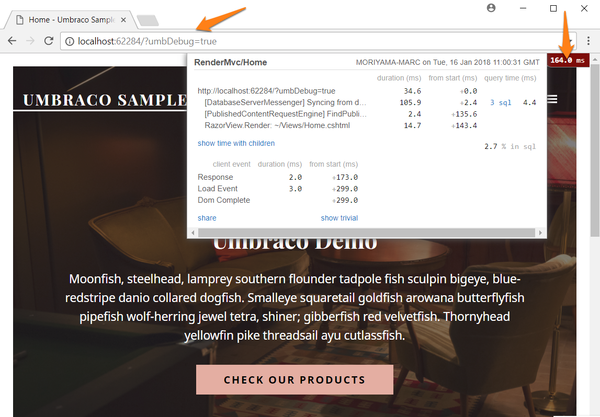
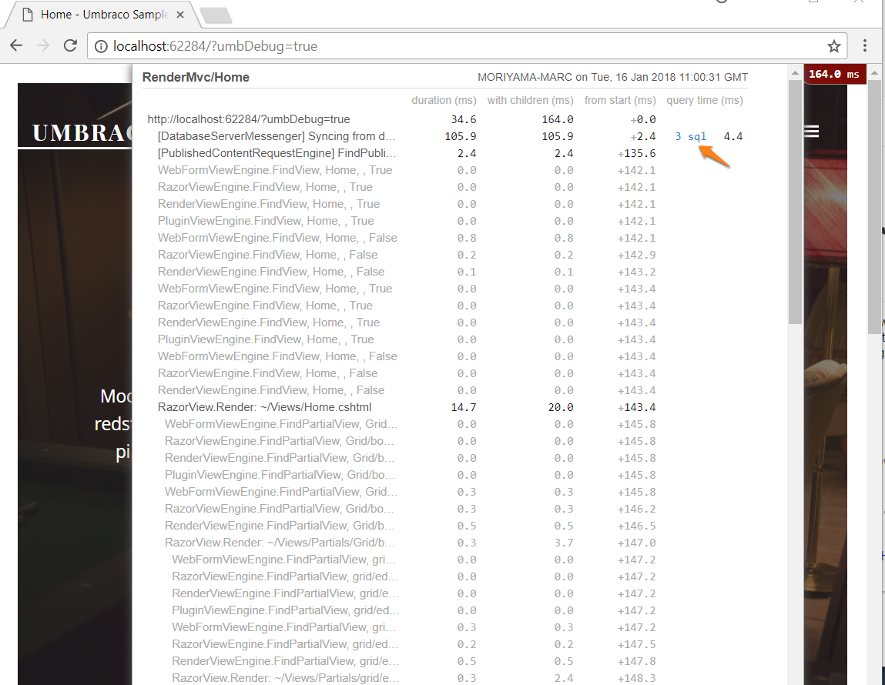
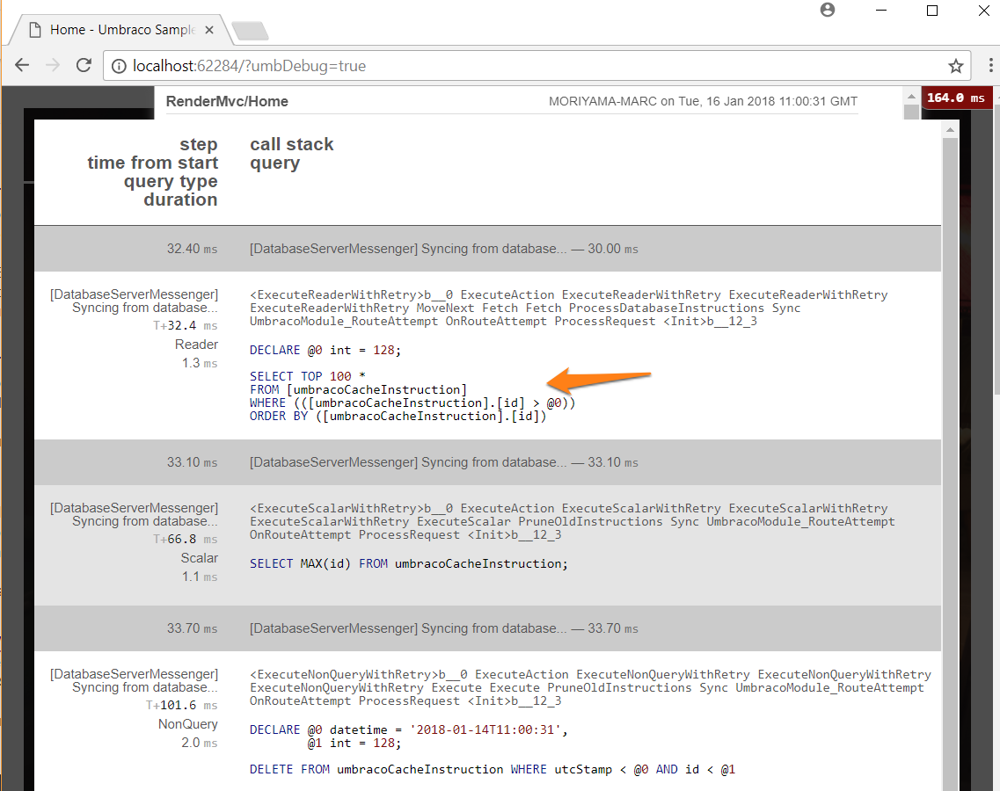
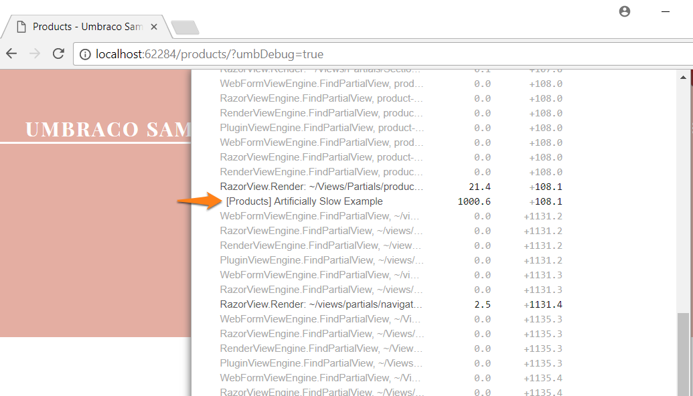
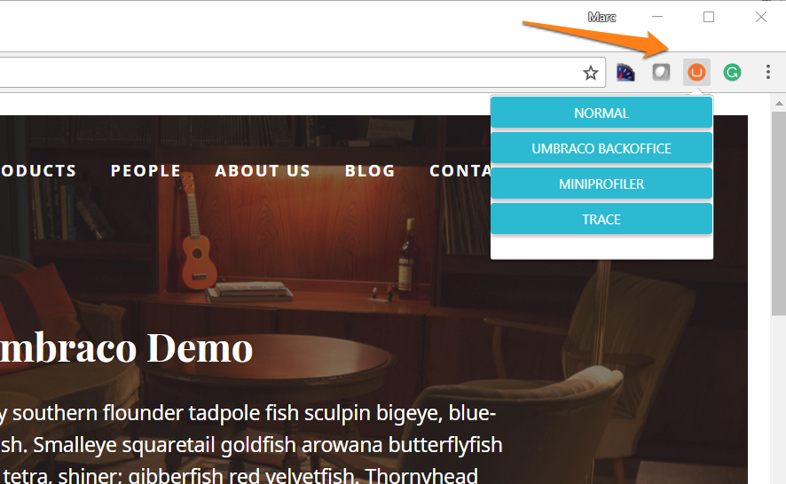
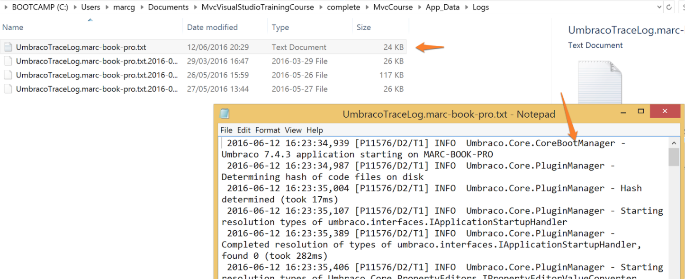

# Debugging
During the development of your Umbraco site you can debug, and profile the code you have written to analyse and discover bugs, bottlenecks in your code, or just help uncover what on earth is going wrong.

### Tracing
Tracing enables you to view diagnostic information about a single request for a page on your site at runtime. The trace will show the flow of page level events and display any errors in code along with diagnostic information, eg Server variables, Cookie, Form and Querystring Collections, Application State etc

#### Enabling Trace
NB Do not enable trace in your production environment, it reveals an awful lot about your production environment.

By default trace is disabled, to enable: update the web.config; look for the trace element in the System.Web section and set the enabled attribute to true

    <trace enabled="true" requestLimit="100" pageOutput="false"   
                  traceMode="SortByTime" localOnly="true"/>

#### Viewing Trace

With trace enabled visit the url **/trace.axd**

The current application trace of requests to your application will be displayed:

Click 'Clear current trace' and then in a different tab visit the url of the page you would like to trace.

The trace requests for this page will appear if you refresh your trace.axd tab.

Click on 'View Details' for a particualar request in the list to see the specific trace information for the page.

### MiniProfiler

Umbraco includes the Mini Profiler project in its core (see [http://miniprofiler.com](http://miniprofiler.com) for more details). 
The MiniProfiler profiles your code method calls, giving you a greater insight into code duration, and query time for underlying SQL queries. It's great for tracking down performance issues in your site's implementation.

#### Displaying the MiniProfiler

To display the profiler ensure that the debug attribute of the compilation element is set to true in your web.config and then add ?umbDebug=true to the querystring of any request.
NB: debug mode should be disabled for your site in a production environment.

If you click 'Show Trivial' you can seen the kind of detail the MiniProfiler makes available to you about the execution path of your page:

and any underlying SQL Statements that are being executed for a a part of the execution

#### Writing to the MiniProfiler

If within your implementation there are certain lines of code that you think may contain a bottleneck, the MiniProfiler gives you a method for timing just those specific lines of code:

    var profiler = ApplicationContext.ProfilingLogger;
    using(profiler.DebugDuration<Products>("Artificially Slow Example"))
    {
        // you would place the code you wanted to measure in here...
        //just make this sleep for a second, for example purposes:
        System.Threading.Thread.Sleep(1000);
    }

and now in the profiler you can see 

#### Umbraco Productivity Tool- Chrome Extension

If you are using the Google Chrome browser you can install this [Umbraco Productivity Tool Chrome Extension](https://chrome.google.com/webstore/detail/umbraco-productivity/kepkgaeokeknlghbiiipbhgclikjgkdp?hl=en)

To enable you to easily access and switch between the Miniprofiler / Trace debugging modes.

### Logging

Umbraco uses the Apache Log4Net library to output log statements to a set of Trace logs, to help you investigate problems with your Umbraco Installation. You can write to these log files from your custom code.
 

The configuration for log4net is found in your Umbraco site here: /config/log4net.config you can set the priority of the level of the logs information to be stored here:

    <priority value="Info"/>

Full details of Log4Net configuration options can be found here: http://logging.apache.org/log4net/release/manual/configuration.html

The default location for trace logs in your application will be /app_data/logs/ with a file created for each day of logging information.
There is a useful Umbraco Package called Diplo Trace Log Viewer that will enable you to see this log file information from the developer section of the Umbraco Backoffice: https://our.umbraco.org/projects/developer-tools/diplo-trace-log-viewer/

##### Writing to the logs

Umbraco provides a helper to enable you to log information from within your custom code.

You will need to add a reference to Umbraco.Core.Logging in your class / view:

    using Umbraco.Core.Logging;

and then from within your code you can use the helper to log information

    LogHelper.Info(typeof(NameOfClassYouAreLoggingFrom), "Your logging message");

or more generically if you are not sure of the class...

    LogHelper.Info(this.GetType(),"Your logging message");

There are methods to add logging at different priority levels:

* Debug - Used in development and testing, contains the most information, and likely information to help you diagnose a problem - avoid running a production site 'in debug'.
* Information - Useful status information regarding the running and management of your site, eg xx started correctly.
* Warn - For exceptions that are expected and handled in your code but useful to flog - eg missing configuration.
* Error - For exceptions that are not handled in code.

